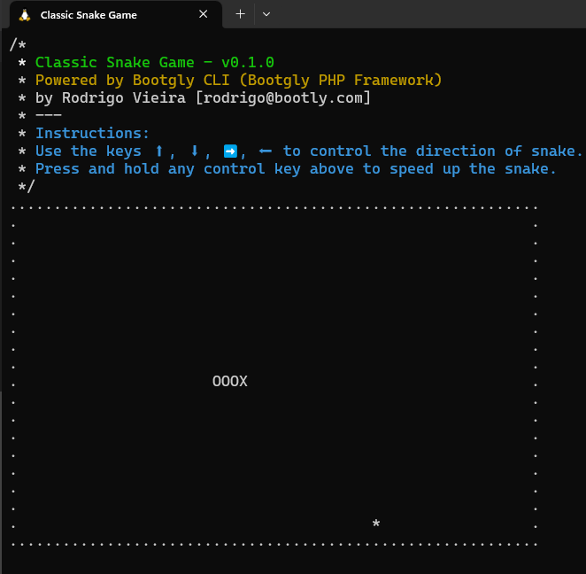

  

<h1 align="center">Classic Snake Game</h1>

  <i>Powered by Bootgly CLI (from <a href="https://packagist.org/packages/bootgly/bootgly-php-framework">Bootgly PHP Framework</a>).</i>

  

---
# 🤔 About
This repository is part of [Bootgly Awesome][BOOTGLY_AWESOME].

The purpose was to demonstrate the power of the Client-Server interface to CLI of the Bootgly CLI which is part of the [Bootgly PHP Framework][BOOTGLY_PHP_FRAMEWORK].

No additional extensions (like ncurses) were used, only `stty` system commands.

# 🚀 Deploy

## 🤝 Compatibility

Operation System | Terminal
--- | ---
✅ Linux (Debian based) | ✅ Windows Terminal (WSL2)
❌ Windows | ✅ GNOME
❔ Unix | ❔ Zsh, Fish, Konsole, Terminator

✅ = Compatible
❌ = Incompatible
❔ = Untested

## 📦 Dependencies

- PHP 8.2+ ⚠️
- Opcache with JIT enabled (+50% performance) 👍
- Composer ⚠️

⚠️ = Required
👍 = Recommended

## ⚙️ Install

`composer install`

## ▶️ Play

To start the game, in the root folder type in your terminal:

`php bootgly`

---

## 🖼 Screenshots

---

## 📃 License

The Bootgly PHP Framework is open-sourced software licensed under the [MIT license][MIT_LICENSE].

<!-- Links -->
[BOOTGLY_AWESOME]: https://github.com/bootgly/-awesome
[BOOTGLY_PHP_FRAMEWORK]: https://github.com/bootgly/bootgly-php-framework
[MIT_LICENSE]: https://opensource.org/licenses/MIT
